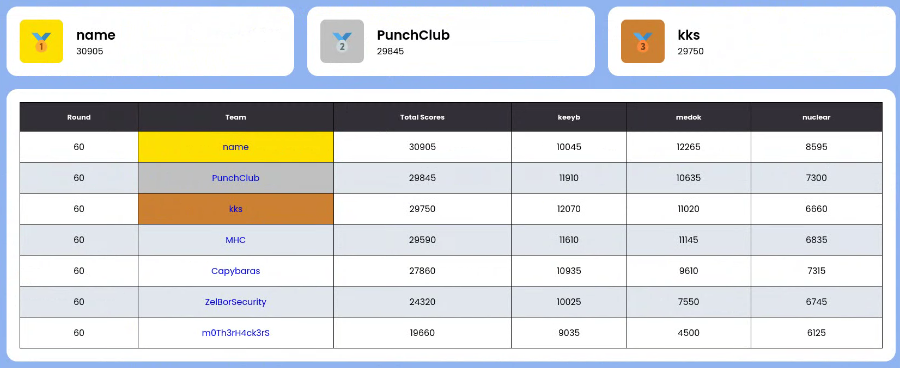

# RedShift-Eclipse-2 - Finals 2024 (Winter) Defense CTF

**RedShift-Eclipse-2** - открытое мероприятие, проводимое командой o1d_bu7_go1d. В финальном этапе участвует ТОП-7 команд по итогам отборочных соревнований.  

Список используемых сервисов в рамках игровой сессии:

| Service Name       | Language                | Author       |
| :----------------: | :---------------------: | :----------: |
| nuclear            | С                       | ZevsMi       |
| medok              | Python                  | boomgarang   |
| keeyb              | PHP                     | Abends2      |

Разбор всех уязвимостей и патчей к сервисам можно найти внутри репозитория в папке **write-ups** (локально открывать через **Obsidian**)

Работоспособность всех сервисов протестирована на **Linux Debian 12**.

В папке **[scripts](Platform-scripts/scripts)** лежат checkers и sploits, но для платформы **AvoidAttack**. Эти же скрипты дублиуются в **[checkers](RedShift-Eclipse-2-Services/checkers)** и **[sploits](RedShift-Eclipse-2-Services/sploits)**. Последние стоит использовать при разборе write-ups