# RedShift-Eclipse-2 - Finals 2024 (Winter) Defense CTF

## [0x00] About RedShift-Eclipse-2 - Finals 2024 (Winter)

**RedShift-Eclipse-2** - открытое мероприятие, проводимое командой o1d_bu7_go1d. В финальном этапе участвует ТОП-7 команд по итогам отборочных соревнований.

Перечень сервисов:
1. nuclear - C
2. medok - Python
3. keeyb - PHP

---

## [0x01] Scores and Status codes

Sploits:
- 101 OK: The host is vulnerable
- 102 NO: The host is not vulnerable 
- 110 SPLOIT ERROR: Internal error in sploit

Checkers:
- 101 OK: The service works correctly
- 104 DOWN: The service doesn't work
- 110 CHECKER ERROR: Internal error in checker

---

## [0x02] Service 1: nuclear

Система SCADA `nuclear` предназначена для взаимодействия с ядерным реактором в городе X-State, разработана компанией Atech SCADA. Она предназначена для автоматизации контроля и управления технологическими процессами на сложных промышленных объектах, включая ядерные реакторы. У властей города после проведения очередной комиссии по безопасности возникли сомнения по части информационной безопасности системы, начиная с документов до наличия некоторых уязвимостей. Для хакеров нет ничего невозможного. Кто-то из членов комиссии слил информацию об уязвимостях...

### Vuln 1: Overflow

`gets` - в функции `authenticate_user` - при вводе пароля используется уязвимая функция `gets()`.

### Patch for Vuln 1

Задача патча - используя IDA PRO (или любой другой инструмент для патча бинарей) изменить эту функцию на `fgets`.

---

### Vuln 2: Adjust Control Rods

`scanf` - в функции `adjust_control_rods` используется следующая конструкция:

```C
int position;

scanf("%lf", &position);
```

### Patch for Vuln 2

Для патча необходимо изменить `%lf` на `%d`

---

### Vuln 3: Wrong Admin Validation

В функции `main` при вводе команде `add_user` в условии присутствует лишнее `false`, в следствие чего проверка на роль `admin` работает некорректно

```C
if (!check_permissions(&current_user, "admin") && false) continue;
```

### Patch for Vuln 3

Для патча необходимо из условия убрать `false`.

---

## [0x03] Service 2: medok

**МедОК** — это инновационный медицинский сервис, который делает обращение за медицинской помощью быстрым, удобным и доступным. Мы стремимся упростить процесс взаимодействия с врачами,чтобы вы могли сосредоточиться на самом главном — своём здоровье. У очередной госкомиссии возник вопрос: "А стремятся ли они обеспечить безопасность?"

### Vuln 1: SSTI in registration

Сервис **medok** наделен уязвимостью SSTI (Server-Side Template Injection) в функции регистрации (**main.route('/register)**) файла **routes.py**, которая позволяет реализовать удаленное исполнение кода (RCE):

```python
message = """Пользователь %s успешно зарегистрирован.
<meta http-equiv="refresh" content="0;url={{ url_for('main.profile') }}"> """
return render_template_string(message % name)
```

Уязвимость обеспечивает функция render_template_string(), в которую производится передача данных без фильтрации. Таким образом при отправке следующего payload в функцию можно выполнить произвольный код:

```python
{{ self.__init__.__globals__.__builtins__.__import__('os').popen('id').read() }}
```

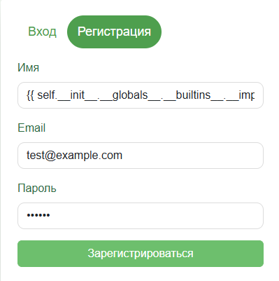

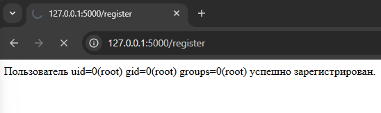

### Patch for Vuln 1

Для закрытия уязвимости можно использовать функцию redirect(), не выводя сообщение об успешной регистрации пользователя:

```python
# Безопасный редирект в профиль

return redirect(url_for('main.profile'))
```

Таким образом, в шаблон функция не передает ничего, а информация о пользователе подтягивается автоматически. В итоге, профиль доступен, а уязвимость закрыта:

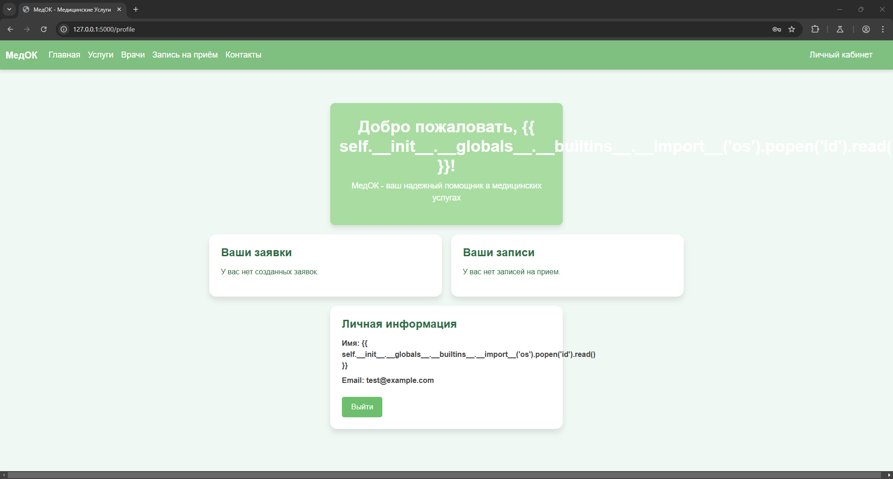

---

### Vuln 2: SQLi in doctors' search

Данная уязвимость происходит в скрипте **utils.py**, функции **get_doctors_from_db()** при составлении запроса к БД. Как видно из кода, пользовательский ввод передается в зарос напрямую, без фильтрации:

```python
query = f"""
    SELECT * FROM doctors
    WHERE LOWER(full_name) LIKE '%{search_query.lower()}%'
"""
cursor.execute(query)
```

Уязвимый участок кода может быть использован для выгрузки информации из других таблиц, в частности таблицы users:

```SQL
%' UNION SELECT 1, 2, username, 3, email, password from users -- -
```

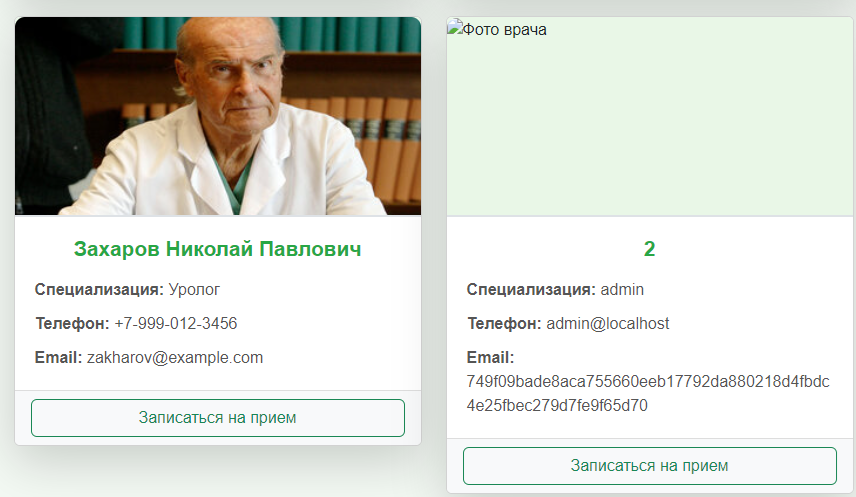

### Patch for Vuln 2

Для закрытия уязвимости необходимо обеспечить достаточный уровень фильтрации пользовательского ввода. Сделать это можно следующим способом:

```python
if search_query:
    # Безопасная передача переменной в SQL-запрос
    query = f"""
        SELECT * FROM doctors
        WHERE LOWER(full_name) LIKE %s
    """
    cursor.execute(query, (f"%{search_query.lower()}%",))
```

В таком случае запрос к БД не вернет ничего:

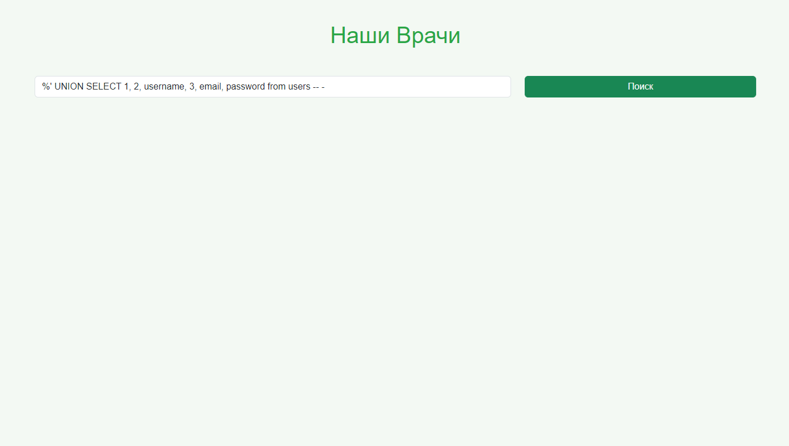

---

### Vuln 3: RCE in services ticket creation

Уязвимость происходит в функции **create_ticket()** файла **utils.py**. Для записи в файл используется функция **os.system()** с применением утилиты **echo**, что является небезопасным и одназчно приводит к удаленному исполнению кода: 

```python
os.system(f'echo "Заявка №{ticket_number}\n\nВаше имя: {name}\n\nВаш номер телефона: {phone}\n\nОставленное сообщение: {message}" > {ticket_filename}')
```

Пример экспулатации уязвимости:

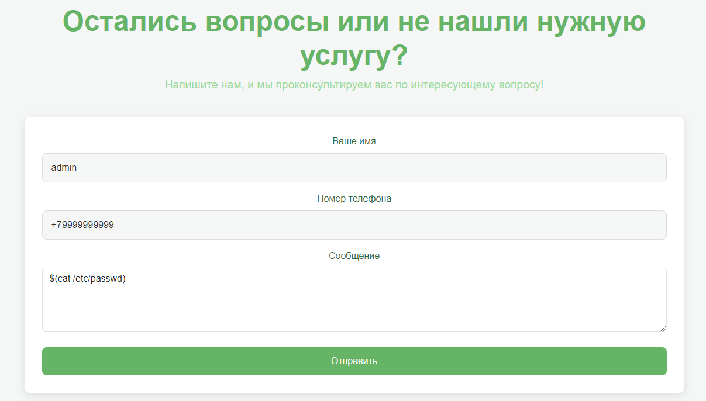

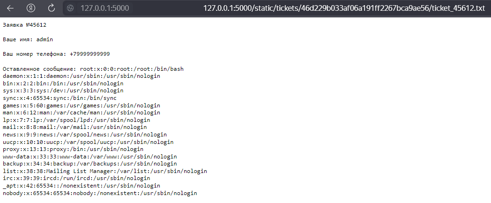

```bash
$(cat /etc/passwd)
```

### Patch for Vuln 3

Уязвимость можно закрыть стандартными методами python3, а именно записью в файл с помощью функции **open(*filename*, 'w')**, что не будет интерпретировано непосредственно самой оболочкой, а обеспечит безопасную запись в файл:

```python
# Отказ от os.system() в пользу open() для предотвращения RCE
ticket_content = (
    f"Заявка №{ticket_number}\n\n"
    f"Ваше имя: {name}\n\n"
    f"Ваш номер телефона: {phone}\n\n"
    f"Оставленное сообщение: {message}"
)

with open(ticket_filename, 'w', encoding='utf-8') as ticket_file:
    ticket_file.write(ticket_content)
```

Таким образом попытка выполнить вредоносный код на стороне сервера будет предотвращена, а в файл запишется отправленный текст:

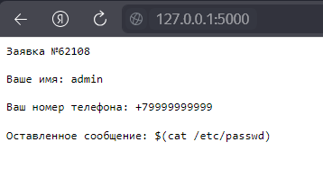

---

### Vuln 4: IDOR in appointments

У пользователя **admin** уже имеется запись к врачу:

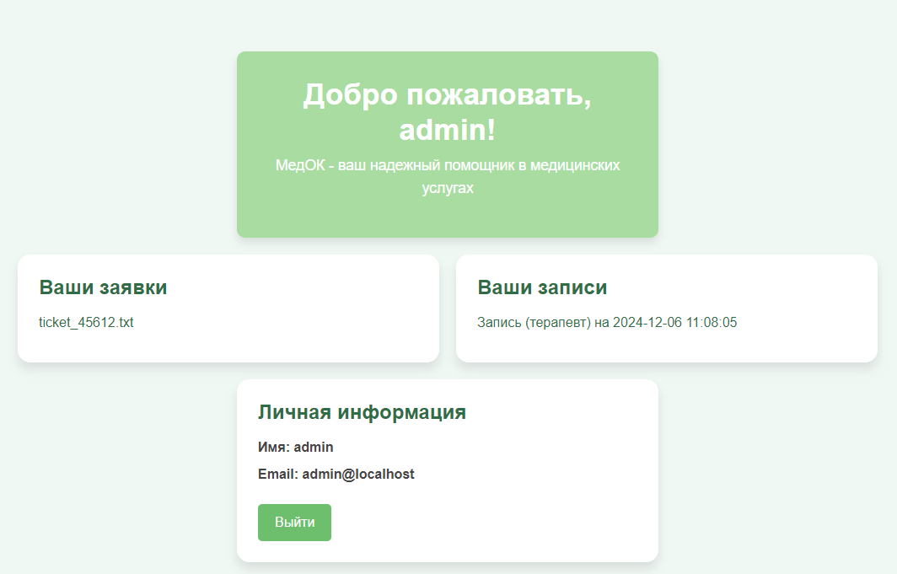

Для реализации уязвимости можно создать другого пользователя (**test**):

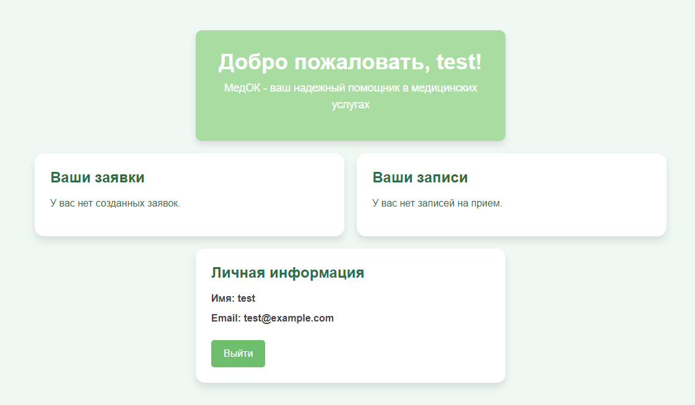

В таком случае можно реализовать уязвимость **IDOR** с помощью перебора интуитивно предсказуемых значений в роуте **@main.route('/view_appointment/<int:user_id>/<int:appointment_id>')**:

```python
@main.route('/view_appointment/<int:user_id>/<int:appointment_id>')
def view_appointment(user_id, appointment_id):
    appointment = get_appointment_details(user_id, appointment_id)
    return render_template('view_appointment.html', appointment=appointment)
```

При выборе значений **user_id=1** и **appointment_id=1** мы получим доступ к той самой записи на прием пользователя **admin**:

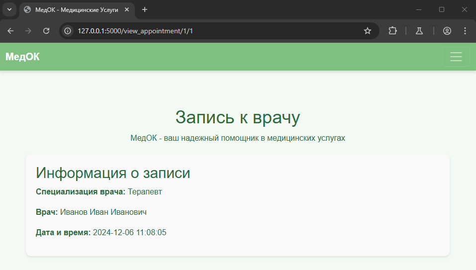

### Patch for Vuln 4

Чтобы избежать этой уязвимости, необходимо лишь обеспечить проверку подлинности (проверять, действительно ли пользователь имеет доступ к запрашиваемой информации). Для этого можно использовать сохраненный в **session** параметр **user_id** при регистрации, а также при входе. Безопасная функция в таком случае будет иметь следующий вид:

```python
@main.route('/view_appointment/<int:user_id>/<int:appointment_id>')
def view_appointment(user_id, appointment_id):
    appointment = get_appointment_details(user_id, appointment_id)

    # Проверка user_id сессии; отсутствие вывода, если user_id не совпал
    if session.get('user_id') != user_id: appointment = None
    return render_template('view_appointment.html', appointment=appointment)
```

И теперь, при попытке несанкционированного доступа к чужой записи на прием, не будет выводиться никакой информации:

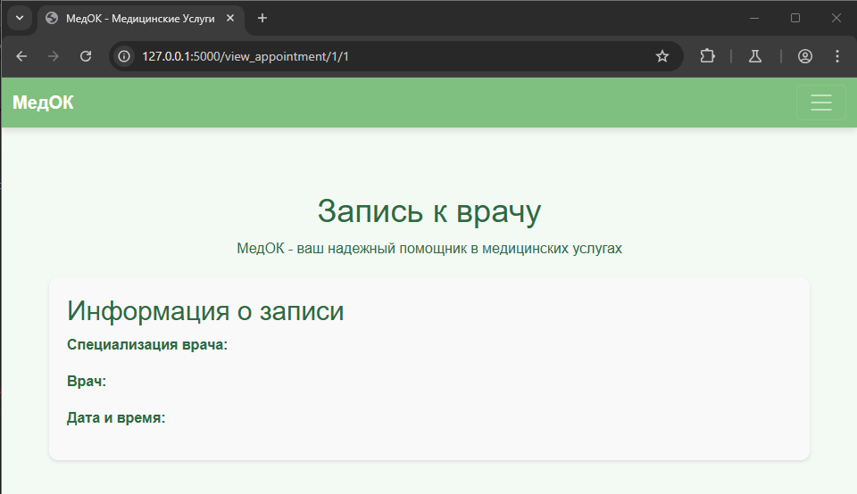

---

## [0x04] Service 3: keeyb

«Keeyb» — ваш идеальный магазин для покупки премиальных кастомных клавиатур. Мы предлагаем широкий ассортимент высококачественных устройств, созданных с учётом индивидуальных предпочтений и потребностей наших клиентов. В «Keeyb» вы найдёте клавиатуры на любой вкус: механические, беспроводные, эргономичные и специально разработанные для определённых платформ, таких как Mac. Кроме того, мы предоставляем услуги по гравировке и модификации клавиатур, а также возможность заказать клавиатуру с индивидуальным дизайном. Очередная компания...

### Vuln 1: SSTI

На сервисе **keeyb** доступно выполение произвольного кода через эксплуатацию уязвимости SSTI. Для ее эксплуатации необходимо перейти в раздел **Training** и в поле ввода ввести полезную нагрузку. Учитываем, что шаблонизатор, используемый в сервисе - **Twig**:

```php
{{["id"]|filter("system")}}
```

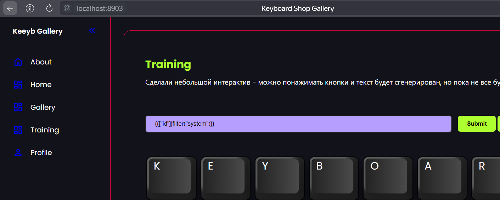

Как можно заметить, команда исполнилась:

```
uid=33(www-data) gid=33(www-data) groups=33(www-data)
```

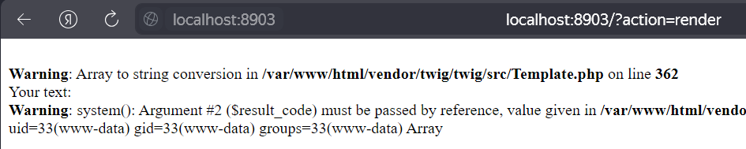

### Patch for Vuln 1

Для того, чтобы исправить уязвимость, необходимо понять причину возникновения уязвимости. Для начала, находим ту часть кода, которая обрабатывает пользовательский ввод в разделе "Training":

```php
<?php
// render.php

if (isset($_SESSION['user'])) {
    if ($_SERVER['REQUEST_METHOD'] === 'POST' && isset($_POST['user_input'])) {
        $user_input = $_POST['user_input'];
        
        try {
            $template = $twig->createTemplate($user_input);
            $result = $template->render(['user' => $user_input]);
            echo "Your text: $result";
        } catch (Exception $e) {
            // Обрабатываем ошибки
            echo 'Ошибка в шаблоне: ' . $e->getMessage();
        }
    } else {
        echo $twig->render('training.twig', ['user' => $_SESSION['user']]);
    }
} else {
    header('Location: /?action=login');
    exit;
}
```

Как можно заметить, данные от пользователя передаются напрямую в шаблон, что позволяет реализовать SSTI:

```php
$template = $twig->createTemplate($user_input);
$result = $template->render(['user' => $user_input]);
```

Код для исправления уязвимости, в котором мы используем заранее заготовленный шаблон **user_template.twig**, а также пользовательский ввод прогоняем через функцию **htmlspecialchars**:

```php
<?php
// render.php

if (isset($_SESSION['user'])) {
    if ($_SERVER['REQUEST_METHOD'] === 'POST' && isset($_POST['user_input'])) {
        $user_input = htmlspecialchars($_POST['user_input'], ENT_QUOTES, 'UTF-8'); // Sanitize user input
        
        try {
            // Using a predefined template instead of creating from user input
            $result = $twig->render('user_template.twig', ['user_input' => $user_input]);
            echo "Your text: $result";
        } catch (Exception $e) {
            echo 'Ошибка в шаблоне: ' . $e->getMessage();
        }
    } else {
        echo $twig->render('training.twig', ['user' => $_SESSION['user']]);
    }
} else {
    header('Location: /?action=login');
    exit;
}
```

Таким образом, нам удалось сохранить функциональность и исправить при этом уязвимость

---

### Vuln 2: RCE in "Get Time"

Вторая уязвимость в сервисе **keeyb** заключается в передаваемом параметре при нажатии на кнопку "Get Time" в профиле:

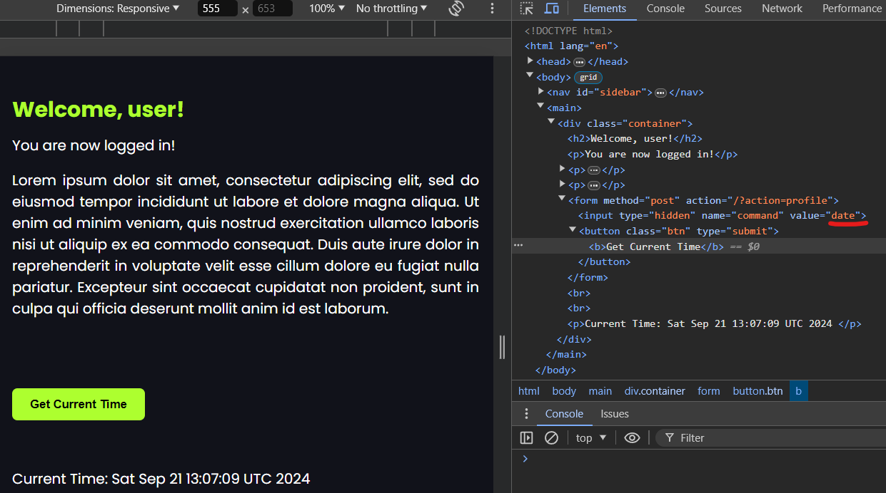

Иными словами, при нажатии на кнопку происходит отправка POST-запроса на **/?action=profile**. При этом отправляется значение **date** на сервер и там обрабатывается. Несмотря на то, что **input** в HTML имеет тип **hidden**, мы можем подставить в **value** другое значение:

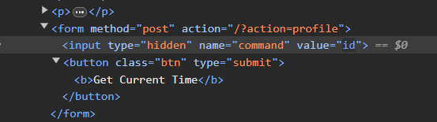

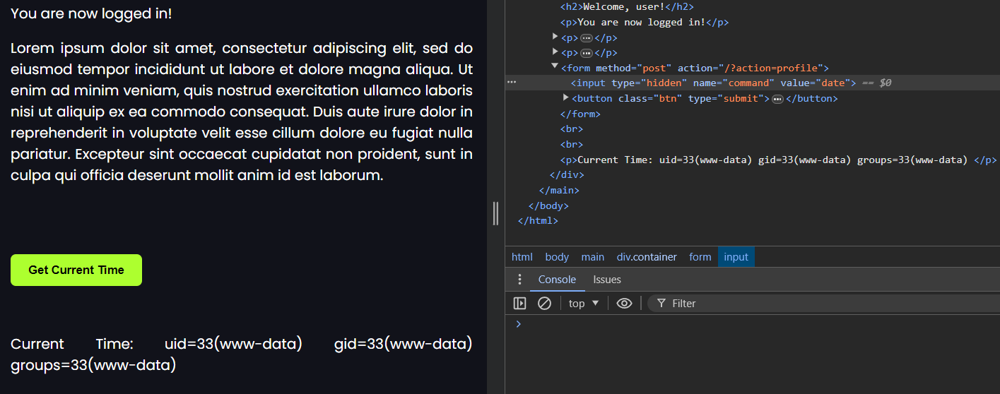

Таким образом, мы получаем RCE. Перейдем к исправлению!

### Patch for Vuln 2

Находим часть кода, которая отвечает за обработку этой формы (**/?action=profile**):

```php
<?php
// profile.php

if (isset($_SESSION['user'])) {
    if ($_SERVER['REQUEST_METHOD'] === 'POST' && isset($_POST['command'])) {
        $command = $_POST['command'];

        $time = shell_exec($command);
        echo $twig->render('profile.twig', [
            'user' => $_SESSION['user'],
            'time' => $time
        ]);
    } else {
        echo $twig->render('profile.twig', ['user' => $_SESSION['user']]);
    }
} else {
    header('Location: /?action=login');
    exit;
}
```

А вот и наша главная проблема:

```php
$time = shell_exec($command);
```

Мы получаем от пользователя произвольную команду, не проверяя выполняем ее и выводим результат. Самое простое решение проблемы - добавить условие для проверки передаваемой команды:

```php
<?php
// profile.php

if (isset($_SESSION['user'])) {
    if ($_SERVER['REQUEST_METHOD'] === 'POST' && isset($_POST['command'])) {
        $command = $_POST['command'];

        // Проверка, чтобы команда была строго 'date'
        if ($command === 'date') {
            $time = shell_exec('date');
        } else {
            $time = 'Unknown time';
        }

        echo $twig->render('profile.twig', [
            'user' => $_SESSION['user'],
            'time' => $time
        ]);
    } else {
        echo $twig->render('profile.twig', ['user' => $_SESSION['user']]);
    }
} else {
    header('Location: /?action=login');
    exit;
}
```

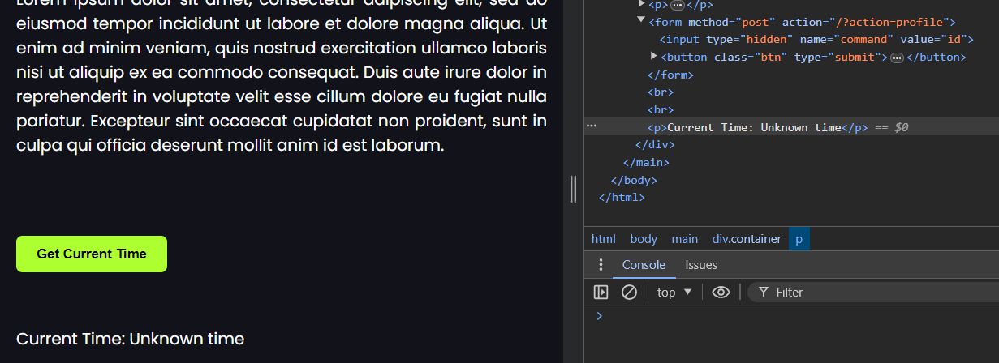

Таким образом, мы успешно исправили все уязвимости на сервисе **keeyb**!

---


